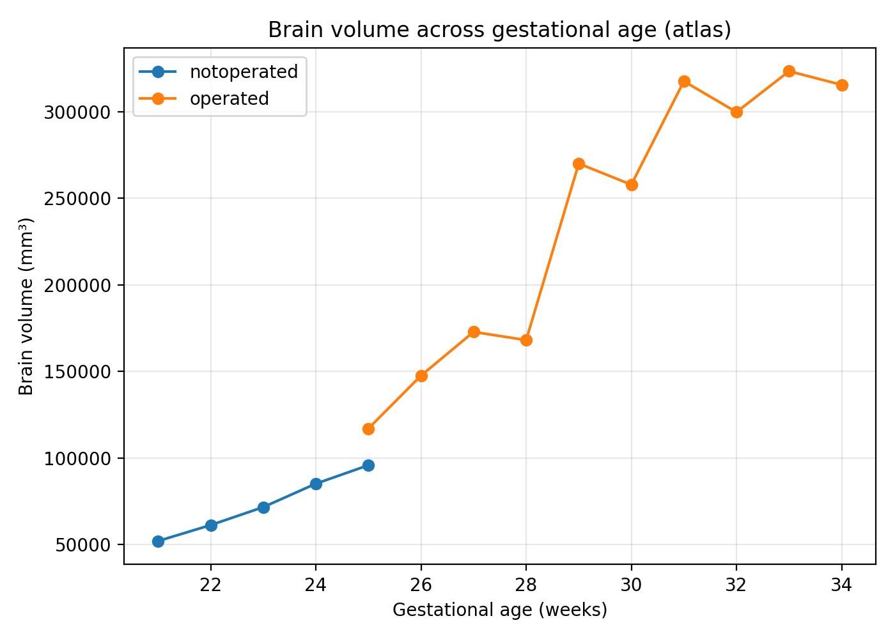
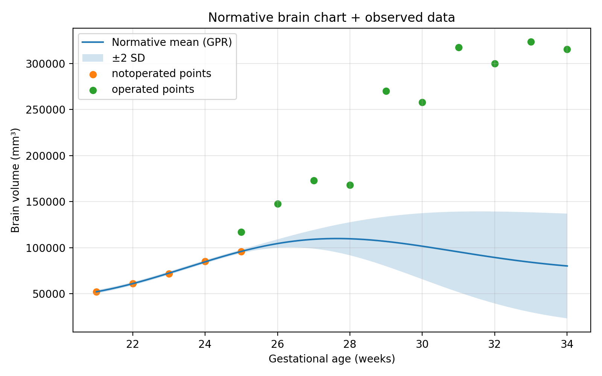

# Normative Modeling of Fetal Brain Development

This repository demonstrates **normative modeling and brain growth chart construction**
using a **spatio-temporal fetal MRI atlas** of spina bifida aperta.

The project was developed as a methodological prototype aligned with
**translational neuroimaging and brain chart frameworks** used in developmental
and neurogenetic research.

---

## 📌 Aim

To model **normative developmental trajectories** of fetal brain structure
and quantify **individual deviations** using Gaussian Process Regression (GPR).

---

## 🧠 Data

- Spatio-temporal fetal brain MRI atlas (GA 21–34 weeks)
- Includes:
  - Reconstructed MRI (`srr.nii.gz`)
  - Brain mask
  - 8-class tissue parcellation
  - Anatomical landmarks

> ⚠️ Raw imaging data are **not redistributed** here.  
> Please access the original dataset via Synapse:  
> https://www.synapse.org/Synapse:syn25887675

---

## 🔬 Methods

- Tissue and whole-brain volume extraction from parcellation maps
- Developmental axis: **Gestational age (weeks)**
- Normative reference: **non-operated fetal brains**
- Modeling approach:
  - Gaussian Process Regression (GPR)
  - Mean trajectory + uncertainty (±2 SD)
  - Individual deviation (z-scores)

---

## 📊 Outputs

### Brain growth charts

### Normative brain chart

### Tissue-specific development

---

## 📁 Repository Structure

